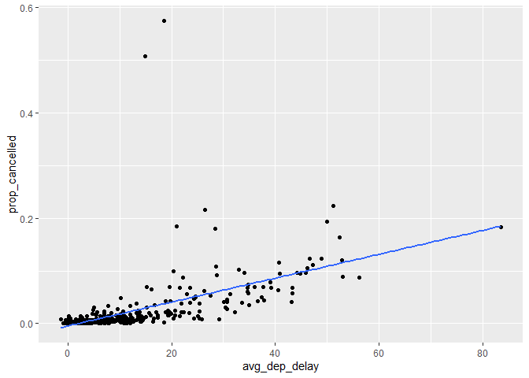

hw1
================
Lejun Xu
2022-09-29

#### 1) How many flights have a missing dep_time? What other variables are missing? What might these rows represent?

``` r
library(nycflights13)
```

    ## Warning: 程辑包'nycflights13'是用R版本4.1.3 来建造的

``` r
library(tidyverse)
```

    ## -- Attaching packages --------------------------------------- tidyverse 1.3.1 --

    ## v ggplot2 3.3.5     v purrr   0.3.4
    ## v tibble  3.1.6     v dplyr   1.0.7
    ## v tidyr   1.2.0     v stringr 1.4.0
    ## v readr   2.1.2     v forcats 0.5.1

    ## -- Conflicts ------------------------------------------ tidyverse_conflicts() --
    ## x dplyr::filter() masks stats::filter()
    ## x dplyr::lag()    masks stats::lag()

``` r
flights
```

    ## # A tibble: 336,776 x 19
    ##     year month   day dep_time sched_dep_time dep_delay arr_time sched_arr_time
    ##    <int> <int> <int>    <int>          <int>     <dbl>    <int>          <int>
    ##  1  2013     1     1      517            515         2      830            819
    ##  2  2013     1     1      533            529         4      850            830
    ##  3  2013     1     1      542            540         2      923            850
    ##  4  2013     1     1      544            545        -1     1004           1022
    ##  5  2013     1     1      554            600        -6      812            837
    ##  6  2013     1     1      554            558        -4      740            728
    ##  7  2013     1     1      555            600        -5      913            854
    ##  8  2013     1     1      557            600        -3      709            723
    ##  9  2013     1     1      557            600        -3      838            846
    ## 10  2013     1     1      558            600        -2      753            745
    ## # ... with 336,766 more rows, and 11 more variables: arr_delay <dbl>,
    ## #   carrier <chr>, flight <int>, tailnum <chr>, origin <chr>, dest <chr>,
    ## #   air_time <dbl>, distance <dbl>, hour <dbl>, minute <dbl>, time_hour <dttm>

``` r
sum(is.na(flights$dep_time))
```

    ## [1] 8255

#### 2) Currently dep_time and sched_dep_time are convenient to look at, but hard to compute with because theyre not really continuous numbers. Convert them to a more convenient representation of number of minutes since midnight.

``` r
flights <- mutate(flights,
       dep_time_mins=(flights$dep_time%/%100*60)+flights$dep_time%%100,
       arr_time_mins=(flights$arr_time%/%100*60)+flights$arr_time%%100)
flights
```

    ## # A tibble: 336,776 x 21
    ##     year month   day dep_time sched_dep_time dep_delay arr_time sched_arr_time
    ##    <int> <int> <int>    <int>          <int>     <dbl>    <int>          <int>
    ##  1  2013     1     1      517            515         2      830            819
    ##  2  2013     1     1      533            529         4      850            830
    ##  3  2013     1     1      542            540         2      923            850
    ##  4  2013     1     1      544            545        -1     1004           1022
    ##  5  2013     1     1      554            600        -6      812            837
    ##  6  2013     1     1      554            558        -4      740            728
    ##  7  2013     1     1      555            600        -5      913            854
    ##  8  2013     1     1      557            600        -3      709            723
    ##  9  2013     1     1      557            600        -3      838            846
    ## 10  2013     1     1      558            600        -2      753            745
    ## # ... with 336,766 more rows, and 13 more variables: arr_delay <dbl>,
    ## #   carrier <chr>, flight <int>, tailnum <chr>, origin <chr>, dest <chr>,
    ## #   air_time <dbl>, distance <dbl>, hour <dbl>, minute <dbl>, time_hour <dttm>,
    ## #   dep_time_mins <dbl>, arr_time_mins <dbl>

#### 3) Look at the number of cancelled flights per day. Is there a pattern? Is the proportion of cancelled flights related to the average delay? Use multiple dyplr operations, all on one line, concluding with ‘ggplot(aes(x= ,y=)) + geom_point()’

``` r
flights %>% group_by(month, day) %>%
  summarize(avg_dep_delay = mean(dep_delay, na.rm = TRUE),
            prop_cancelled = sum(is.na(dep_time)/n())) %>%
  ggplot(mapping = aes(x = avg_dep_delay, y = prop_cancelled)) +
  geom_point() +
  geom_smooth(method = 'lm', se = FALSE)
```

    ## `summarise()` has grouped output by 'month'. You can override using the `.groups` argument.

    ## `geom_smooth()` using formula 'y ~ x'

<!-- -->
